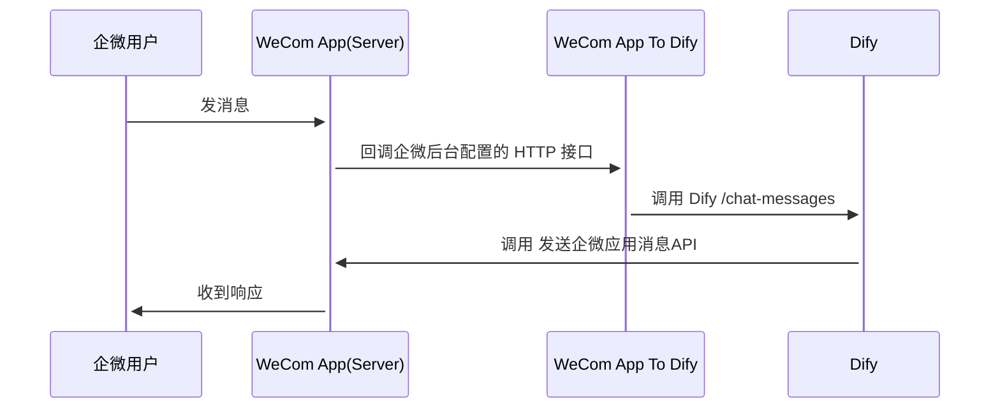

<div align="center">
<h1>WeCom App To Dify</h1>

桥接 WeCom App 和 Dify，接收企微应用消息，然后转发到 Dify



如果我的项目对您有帮助请点一个star吧~

</div>

## 构建

```bash
sh script/build.sh
```

执行之后会自动生成 output 目录，结构如下：

```bash
tree output

output
├── configs                     # 配置文件目录，运行过程中产生的数据也会存储在这个目录中
│   └── config.yml              # 配置文件
├── control.sh                  # 运行脚本（判断当前操作系统，执行对应的可执行文件）
├── linux_main                  # linux 系统可执行文件
└── mac_main                    # mac 系统可执行文件
```

## 配置

在 `output/configs/config.yml` 中填入配置，以下是配置说明：

```bash
server:
  port: 8080                     # 服务端口号
wecom:
  token: 123                     # 企微应用 Token
  aes_key: 123                   # 企微应用 EncodingAESKey
  corp_id: 123                   # 企业ID
  path: /test                    # 需要让企微回调的url
dify:
  host: https://api.dify.ai      # dify host
  api_key: app-xxx               # dify api key
```

## 运行

```bash
sh output/control.sh start       # 启动项目
sh output/control.sh stop        # 停止项目
sh output/control.sh restart     # 重启项目
```

